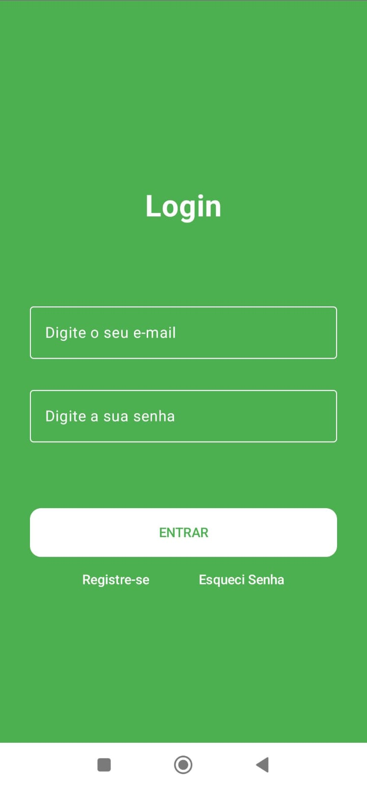

# 📲 BioTrack

App Android em Kotlin para Monitoramento de Biodiversidade

## 🚀 Funcionalidades

- Cadastro de usuário
- Registro de Avistamentos
- Mapa de registro e avistamentos
- Coleta de dados em tempo real

## 📸 Screenshots




## 🛠️ Tecnologias

- Kotlin
- Android Jetpack
- Firebase

## 🔧 Como rodar

Clone o projeto e abra no Android Studio:

```bash
git clone https://github.com/seuusuario/BioTrack.git
